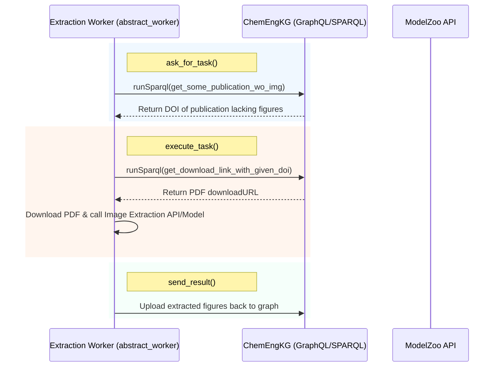

# ModelZoo Developer & AI Context Manifest (`gemini.md`)

Welcome to **ModelZoo**, a specialized system that bridges **Machine Learning models for Chemical Engineering** with a RESTful web API and automated **Knowledge Graph (ChemEngKG)** microservices.

This file serves as a comprehensive developer blueprint and AI context guide for understanding, developing, testing, and containerizing this repository.

---

## 🗺️ Project Architecture & Directory Structure

```text
ModelZoo-KG_Lab_summersemester_2023/
├── .github/                  # CI/CD workflows for building and testing
│   └── workflows/
│       ├── push.yml          # Verifies Docker image builds successfully
│       └── unit_test.yml     # Executes Pytest suite and checks tests
├── app/                      # Main FastAPI web application
│   ├── api/                  # Endpoints split by functional area
│   │   ├── img_classification.py
│   │   └── img_extraction.py
│   ├── models/               # Model metadata structures
│   │   ├── ImageClassification/
│   │   │   └── meta_data/model_info.py
│   │   └── ImageDetection/
│   │       └── meta_data/model_info.py
│   ├── schemes/              # Pydantic schemas for request/response validation
│   │   ├── img_classification_schemes.py
│   │   ├── img_extraction_schemes.py
│   │   └── model_info_scheme.py
│   └── main.py               # FastAPI application initialization & OpenAPI configuration
├── docker/                   # Docker build resources and dependency pre-caching
│   ├── layout_parser.py      # Script to download & cache Detectron2 layout models
│   ├── requirements.txt      # Project library dependencies
│   └── vgg16.py              # Script to download & cache PyTorch VGG16 weights
├── old_app/                  # Outdated/legacy code (not included in production build)
│   └── modules/              # Includes unsupported "SMILES to Property Transformer"
├── services/                 # Microservice worker implementations
│   ├── abstract_worker.py    # ABC for workers interacting with ChemEngKG
│   └── img_extraction/       # Chemical paper image extraction microservice
│       ├── extraction_queries.py # SPARQL query definitions for ChemKG interaction
│       └── extraction_worker.py  # Image extraction worker orchestrating queries and task logic
├── test/                     # Pytest / Unittest suite
│   ├── app/                  # API endpoint tests with FastAPI TestClient
│   ├── assets/               # Sample inputs (e.g., test PNGs, PDFs) for test suites
│   └── services/             # Worker mock tests with unit-test mocking
├── Dockerfile                # Production multi-stage Pytorch-FastAPI container config
├── LICENSE                   # MIT License
└── README.md                 # Basic user introduction and run instructions
```

---

## 🛠️ Technology Stack & Dependencies

The project relies on a highly specialized machine learning and web service environment:

*   **API Framework**: [FastAPI](https://fastapi.tiangolo.com/) (version `0.95.2`) backed by [Uvicorn](https://www.uvicorn.org/) for async ASGI hosting.
*   **Data Validation**: [Pydantic](https://docs.pydantic.dev/) (version `1.10.8`) for clean schema validation.
*   **Deep Learning & Image Processing**:
    *   [PyTorch & Torchvision](https://pytorch.org/) (built on the `pytorch/pytorch:latest` base image).
    *   [Layout Parser](https://layout-parser.github.io/): A library for document image analysis and layout detection (utilizes `Detectron2`).
*   **Knowledge Graph (KG) Integration**:
    *   `kgtool`: Custom interface library installed directly from GitHub ([process-intelligence-research/ChemEngKG_kgtool](https://github.com/process-intelligence-research/ChemEngKG_kgtool)) to query and update the knowledge graph.
*   **Testing**: `pytest`, standard `unittest`, and `coverage` for reporting testing percentages.

---

## 🔌 API Endpoints Summary

FastAPI routes are fully declared in `app/api/` and initialized inside `app/main.py`. Detailed Swagger/OpenAPI documentation is auto-served at `/documentation`.

### 1. Root / Health Check
*   **Route**: `GET /`
*   **Description**: Evaluates if the API container is running.
*   **Response**: `'Hello! This is an API which applies machine learning models for chemical engineering.'`

### 2. Image Classification (Flowsheet Recognition)
*   **Route**: `GET /img_classification/info`
*   **Description**: Retrieves model metadata (e.g., authors, date, and citations for the flowsheet CNN model).
*   **Route**: `POST /img_classification/get_class`
*   **Description**: Classifies an uploaded flowsheet diagram.
*   **Payload Constraints**: Expects a `multipart/form-data` input. Input must be a valid `image/png`.

### 3. Image Extraction (Layout Detection in PDFs)
*   **Route**: `GET /img_detection/info`
*   **Description**: Retrieves layout parser model metadata.
*   **Route**: `POST /img_detection/identify_imgs`
*   **Description**: Evaluates a chemical journal article PDF and identifies bounding boxes (coordinates) where images are located.
*   **Payload Constraints**: Input must be `application/pdf`.
*   **Route**: `POST /img_detection/extract_img`
*   **Description**: Cuts out and returns a specific sub-image from a PDF based on the requested page and bounding box dimensions.

---

## 🤖 Microservices & Workers Architecture

ModelZoo is designed to run continuous background jobs via the **Worker Pattern** to process publications in the chemical engineering domain.



### Base Class: `Worker` (`services/abstract_worker.py`)
All background services inherit from this abstract base class. They must implement:
1.  `asWorker()`: Return unconfigured worker instance.
2.  `_ask_for_task()`: Consult KG to retrieve the next pending task.
3.  `_execute_task()`: Run the ML processing pipeline.
4.  `_send_result()`: Post updated resources or metadata back to the KG.
5.  `run_worker()`: Execute workflow: `ask_for_task` ➔ `execute_task` ➔ `send_result`.

### Concrete Service: `ExtractionWorker` (`services/img_extraction/extraction_worker.py`)
Queries the **ChemEngKG** GraphQL endpoint (`http://h3008088.stratoserver.net:4001/graphql` on graph `KGlab`) via SPARQL to process journal articles:
*   **Queries** (`extraction_queries.py`):
    *   `get_some_publication_wo_img()`: Matches `fabio:JournalArticle` missing figure exemplars, returning a random DOI.
    *   `get_download_link_with_given_doi(doi)`: Finds download link (`skos:note`) for the matched DOI.

---

## 🚀 Execution & Testing Manual

### Local Run Instructions
To run the FastAPI server directly on a host machine:
```bash
# Install dependencies
pip install -r docker/requirements.txt

# Run ASGI server with hot reloading
uvicorn app.main:application --host 127.0.0.1 --port 8080 --reload
```
You can then view the Interactive Swagger documentation at `http://127.0.0.1:8080/documentation`.

### Running with Docker
The repository includes a Dockerfile designed to build and pre-cache model weights (so it works efficiently inside sandbox environments without downloading large assets on every startup):
```bash
# Build the Docker image
docker build -t kglab-model-zoo .

# Run the container
docker run -d --name kglab -p 80:80 kglab-model-zoo
```

### Running the Test Suite
Tests are located in `./test` and can be run using `pytest` or `unittest`.

```bash
# Install coverage library
pip install coverage

# Run tests and collect coverage metrics
python -m coverage run -m unittest

# Output a stdout coverage report
python -m coverage report

# Generate beautiful HTML coverage pages
python -m coverage html
```

---

## 📝 Rules & Guidelines for AI Agents & Developers

When making modifications or adding new features to ModelZoo, keep the following principles in mind:

### 1. Import Organization
*   Always use absolute imports relative to the root folder (e.g., `from app import schemes` or `from app.models...`).
*   Group imports: standard python libs, third-party frameworks (fastapi, torch), and then internal application modules.

### 2. Schema Integrity (Pydantic & FastAPI)
*   Whenever creating new endpoints, ensure proper Pydantic request/response models are added to `app/schemes/`.
*   Provide robust `Field(description="...")` annotations on all model fields. This ensures the OpenAPI schema generated at `/documentation` remains extremely legible and self-documenting.

### 3. Model Weight Caching in Docker
*   If adding a new PyTorch or LayoutParser model, **do not download weights on the fly during runtime**.
*   Create a caching script inside the `docker/` directory (similar to `docker/vgg16.py` or `docker/layout_parser.py`) and ensure it is executed during the `docker build` phase in the `Dockerfile`.

### 4. Background Workers
*   All new workers must inherit from `services.abstract_worker.Worker`.
*   Ensure that SPARQL queries are structured using parameter-filtered string formatting to prevent query injection and syntax failures.
*   Write mock unit tests matching the structure of `test/services/test_worker__img_extraction.py` by patching `kgtool.interface.ChemKG` and isolating network connections.

---

> [!TIP]
> Keep code modular, ensure all endpoints are covered under unit tests in the `test/` directory, and verify containerization builds succeed prior to pushing code to remote repositories.
